# examples/curves

The format 1.7 demos: curves, smooth surfaces, sweeps, and morphs on all
of them. `node examples/curves/generate.mjs` rebuilds the files; open the
folder in Uranus to play them.

- **blob.fart** (2D): a creature drawn with `path` shapes, four cubics
  for the body, a stroked path for the smile. The `squash` and `stretch`
  states morph the body's vertices (the handles ride along) and flatten
  the smile; `blink` scales the eyes. Clips: `bounce` (loop) and `blink`.
- **slime.fart** (3D): a cage of twelve sides, two rings and two poles,
  drawn subdivided twice (`smooth: 2`) with a quarter crease round the
  base so it sits on a soft lip. The `squash`, `stretch` and `lean`
  states morph the cage and the smooth surface follows; the eyes ride
  the body. Clips: `bounce` and `wobble`. `npx fart gltf slime.fart`
  exports it with three morph targets and both animations.
- **vase.fart** (3D): a `sweep` lathe of a curved profile, smoothed
  once, with an extruded flat lid; the `turn` clip spins it.
- **shelf.shart**: the solids placed together in one 3D scene, two
  slimes on different clips and the vase turning.

The complex ones, from `node examples/curves/generate-faces.mjs`:

- **head.fart** (3D): a 130-point cage lathed from a profile and
  sculpted (a mouth dented in, a nose out), drawn subdivided once with
  smooth normals. Five states are blend shapes on that one cage, `open`,
  `smile`, `frown`, `pout` and `blink`, each a morph of the same 130
  points; the `talk` clip speaks through them, `moods` drifts between
  expressions. Hair is a second lathe, the eyes ride the face.
- **flag.fart** (3D): a 17 × 11 grid of 160 quads on a pole, smooth
  normals, six states carrying the wave at six phases; the `wave` clip
  lerps cage to cage and the cloth travels.
- **face.fart** (2D): a face of paths whose mouth is one six-vertex path
  morphed through the visemes `A`, `O`, `E`, `M` and `smile` (the
  handles morph too); the `speak` clip runs them. The brows and eyes
  pose as parts.

## Playing

The clips recorded from the studio (`node studio/test/gifs.mjs <dir>` records them):

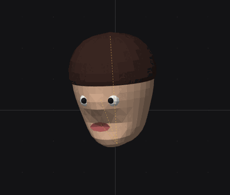 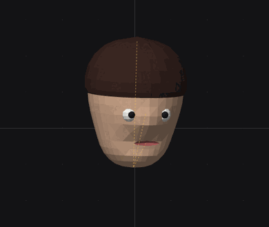 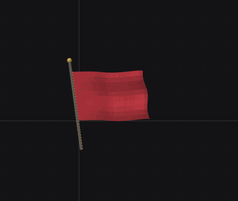

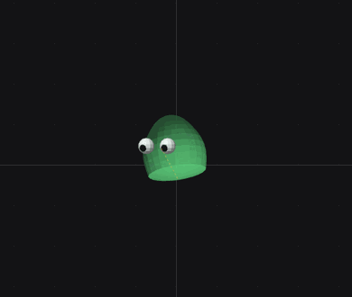 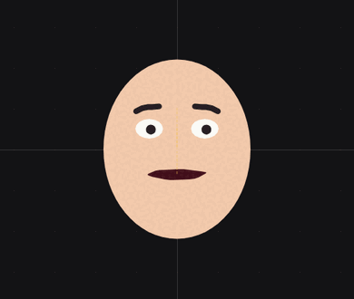 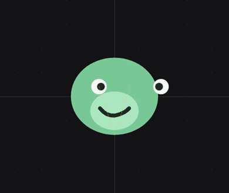

## Shots

Frames from the studio (`node studio/test/shots.mjs <dir>` regenerates them):

| blob: idle, squash, stretch | slime: rest, squash, stretch |
|---|---|
| 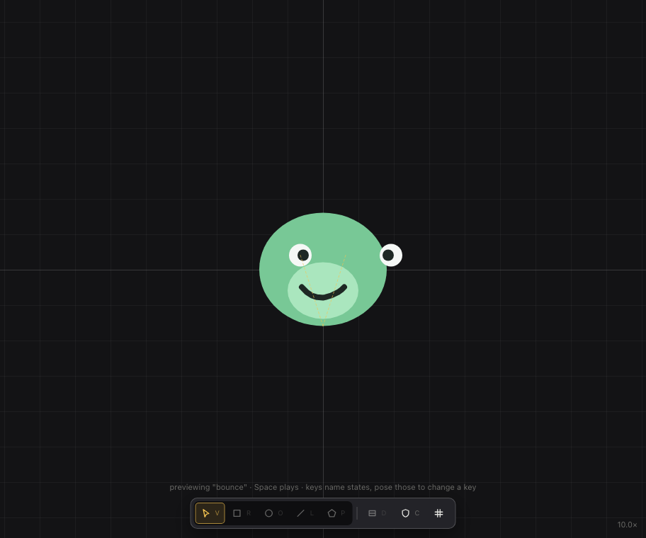 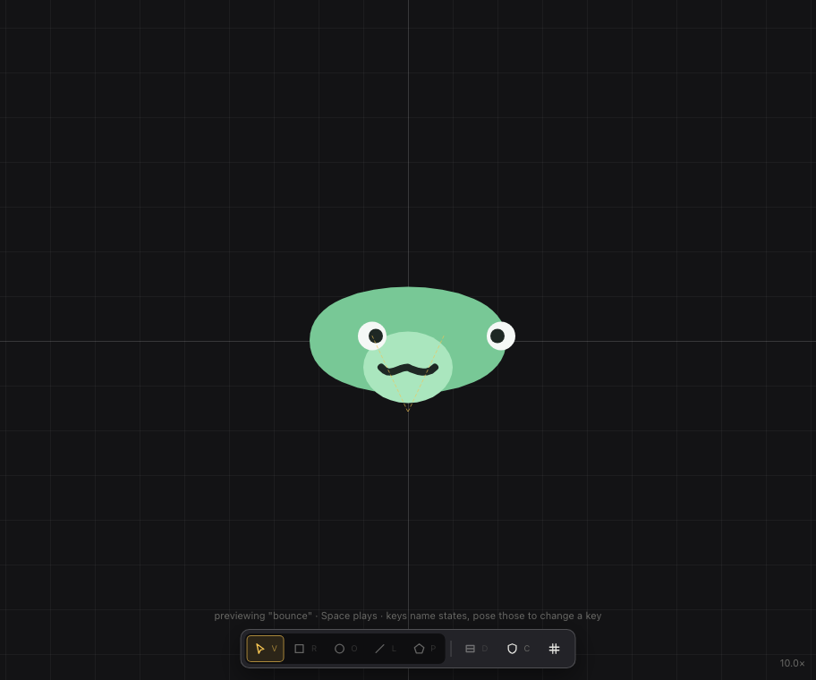 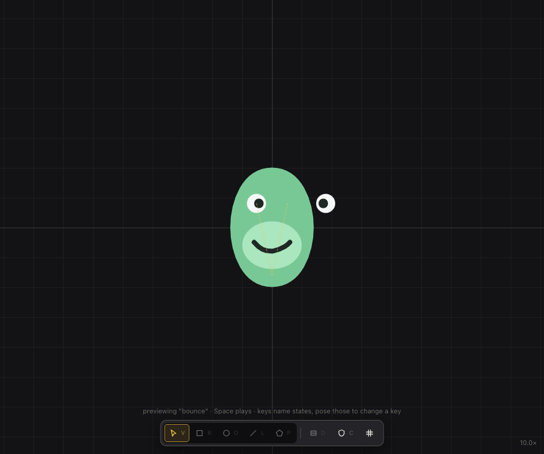 | 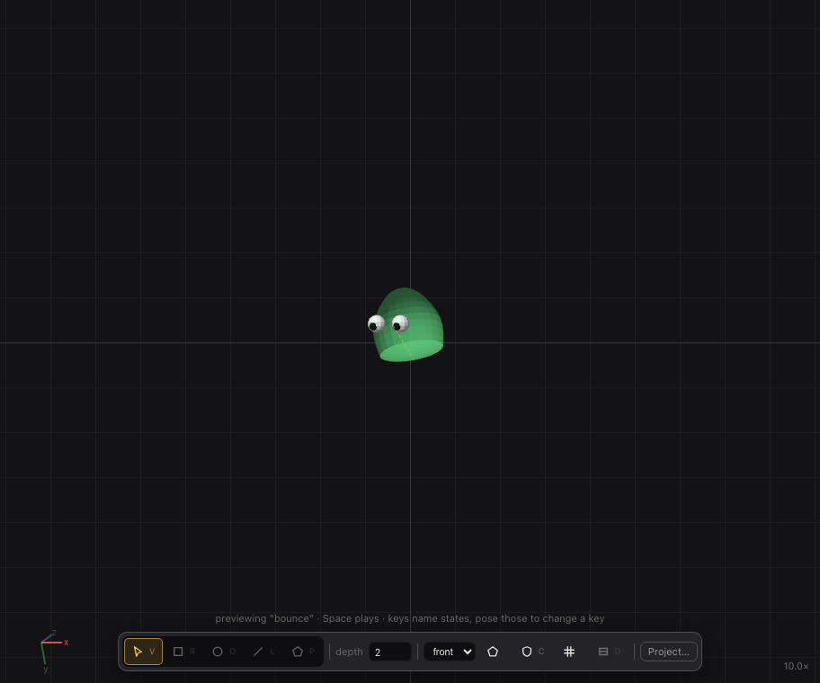 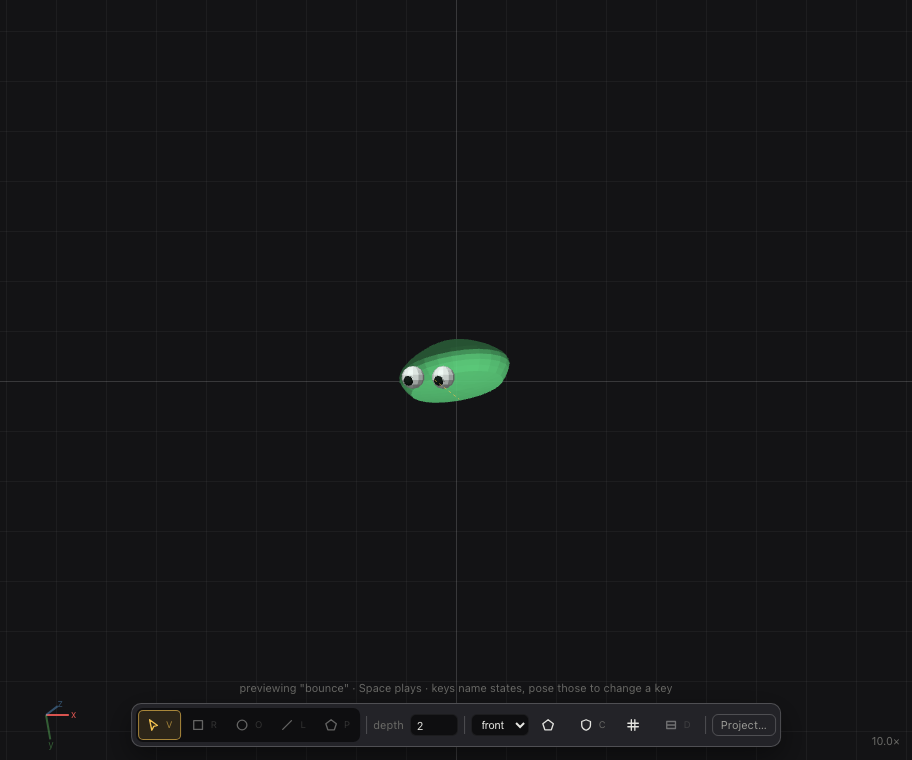 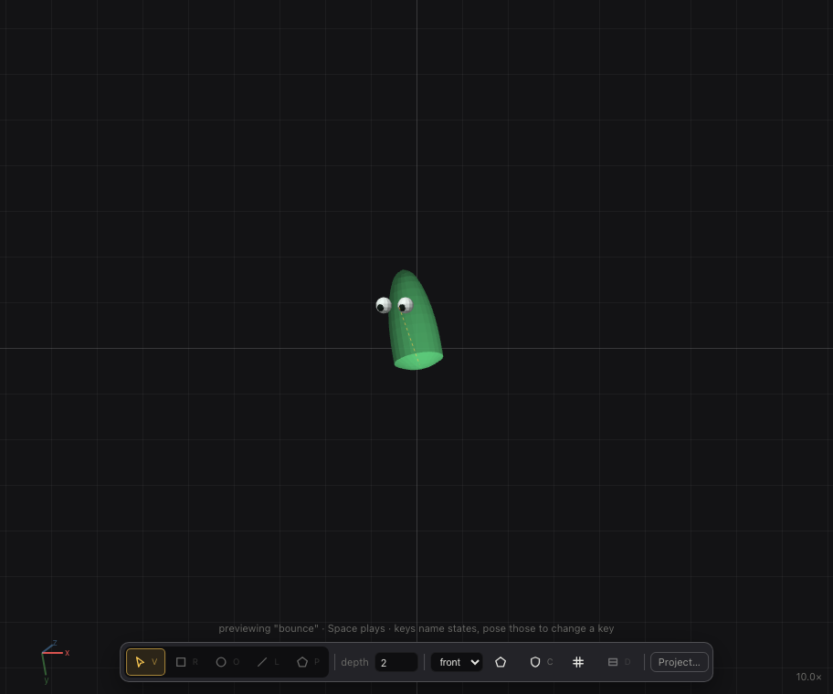 |

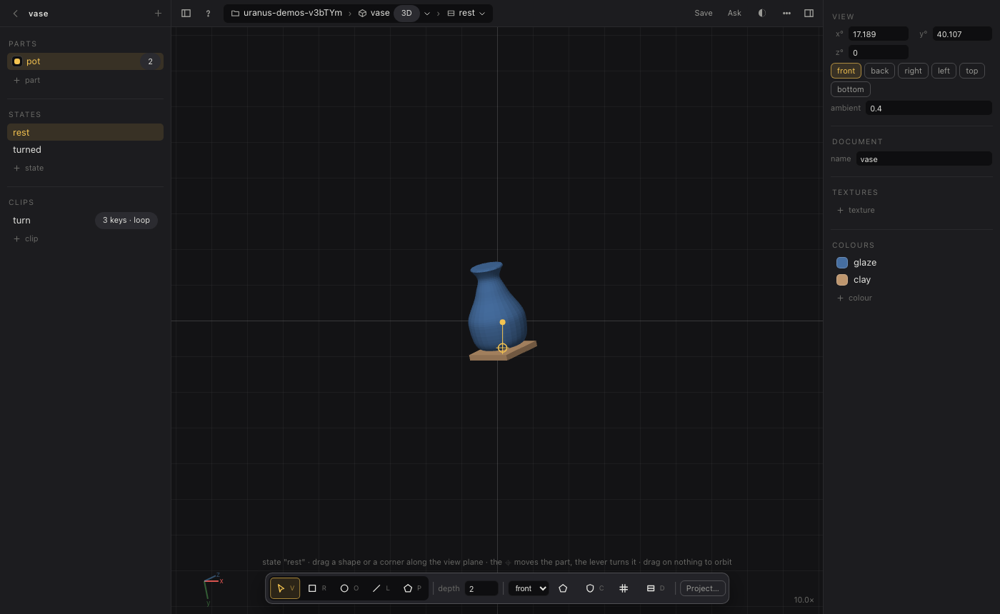 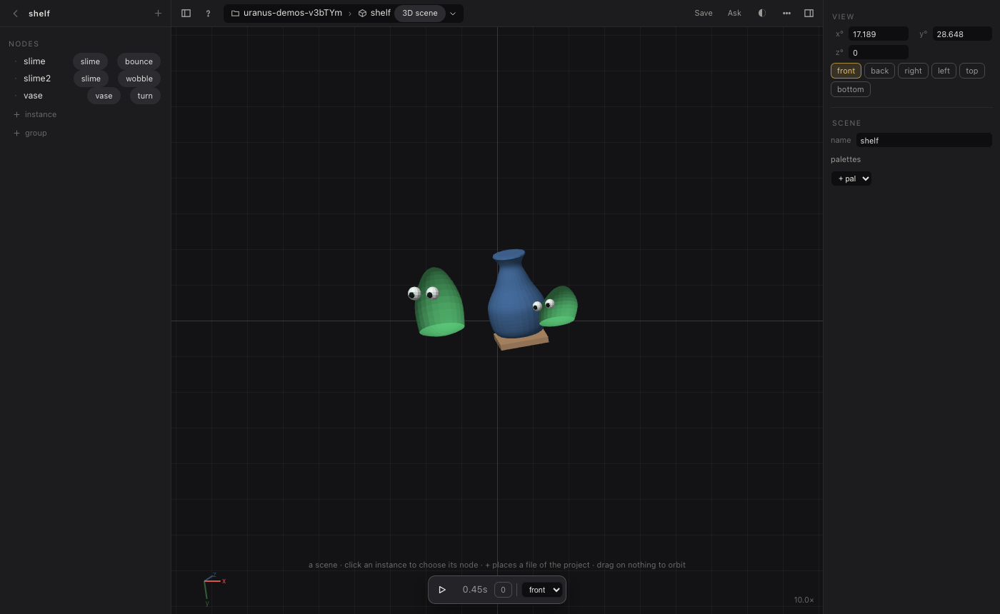
